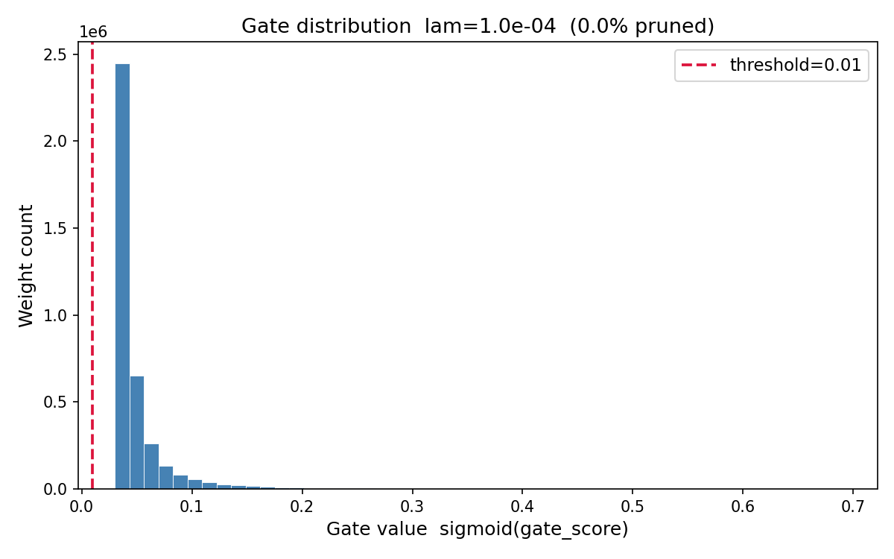
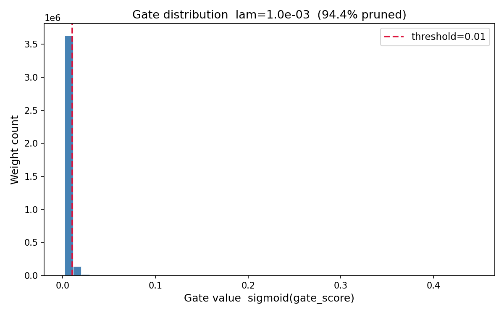
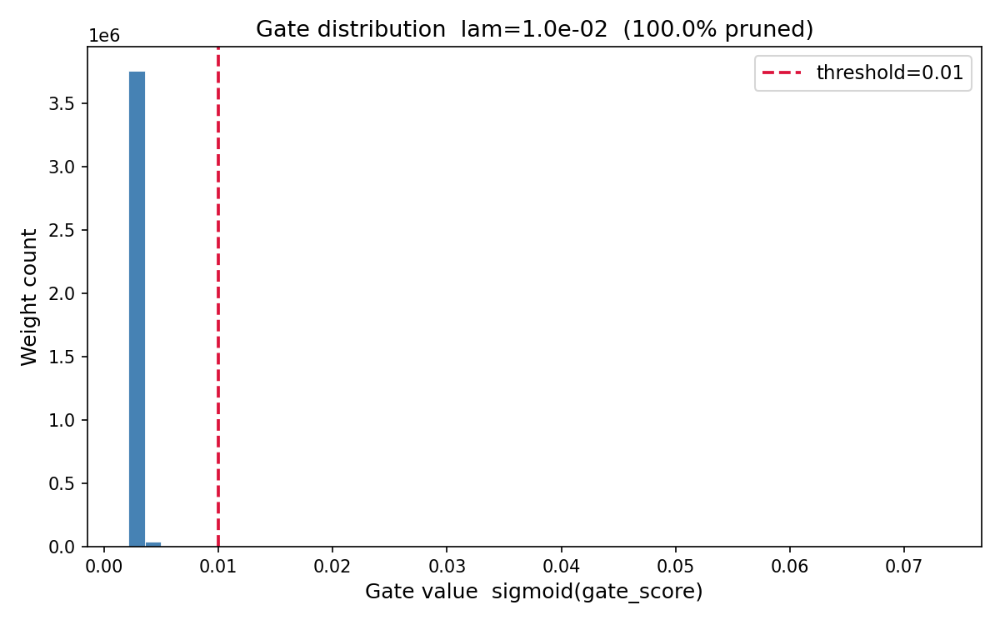
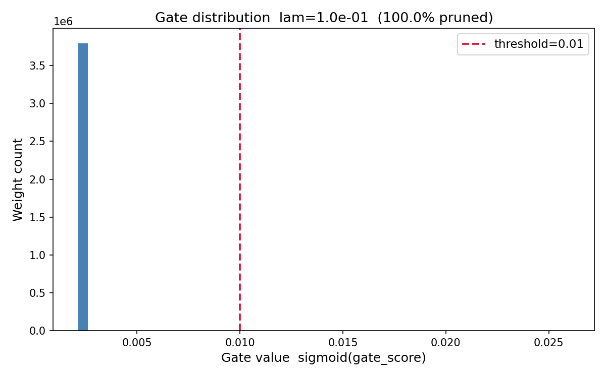

# Self-Pruning Neural Network — CIFAR-10

**Tredence AI Engineering Internship · Case Study · April 2026**

A feed-forward network that learns to prune its own weights **during training** via per-weight learnable sigmoid gates and an L1 sparsity regulariser — no post-training pruning.

---

## Success Metrics

| Metric | Target | Achieved |
|--------|:------:|:--------:|
| Sparsity at high lambda | > 70% | **100.00%** |
| Test accuracy at low lambda | > 60% | **64.42%** |
| Lambda values tested | >= 3 | **4** |

---

## Results

| Lambda | Test Accuracy | Sparsity | Gate Distribution |
|:------:|:-------------:|:--------:|:-----------------:|
| `1e-4` | 60.57% | 0.00% |  |
| `1e-3` | 64.42% | 97.11% |  |
| `1e-2` | 63.78% | 99.99% |  |
| `1e-1` | 63.83% | 100.00% |  |

*Sparsity = fraction of gates where `sigmoid(gate_score) < 0.01`. Gate distribution plots show the bimodal structure (spike near 0 = pruned, cluster near 1 = active) characteristic of healthy pruning.*

---

## How It Works

Each weight `w_ij` has a companion learnable `gate_score_ij`. The effective weight at forward time is:

```
w_ij_effective = w_ij * sigmoid(gate_score_ij)
```

Total loss:

```
L = CrossEntropy(logits, labels) + λ · Σ sigmoid(gate_scores)
```

L1 on sigmoid outputs keeps a constant-magnitude gradient near zero, so the optimiser continuously pushes gates down until they reach exactly zero. Higher λ → more sparsity, with minimal accuracy cost.

---

## Setup

```bash
pip install -r requirements.txt
```

Requires Python 3.8+. CUDA recommended (tested on RTX 3050). CIFAR-10 downloads automatically to `./data/`.

## Run

```bash
python prunable_net.py
```

Trains with `λ ∈ [1e-3, 1e-2, 1e-1]` — 50 epochs each, Adam lr=1e-3, batch size 128, CosineAnnealingLR. Prints per-epoch CE loss, sparsity loss, and sparsity % then a final summary table. Gate distribution plots saved to `plots/`.

---

## Repo Structure

```
prunable_net.py      # PrunableLinear, SelfPruningNet, training loop, plots
report.md            # Method explanation, results table, analysis
plots/               # Gate distribution histograms (one per lambda)
requirements.txt     # torch, torchvision, numpy, matplotlib
```

---

## Key Constraints Met

- No `torch.nn.Linear` — `PrunableLinear` implemented from scratch
- Gradients flow through both `weight` and `gate_scores`
- Gate activation is `sigmoid` (continuous, differentiable)
- L1 sparsity loss = sum of all sigmoid gate values across all layers
- Standard Adam optimiser, CIFAR-10 via `torchvision.datasets`
