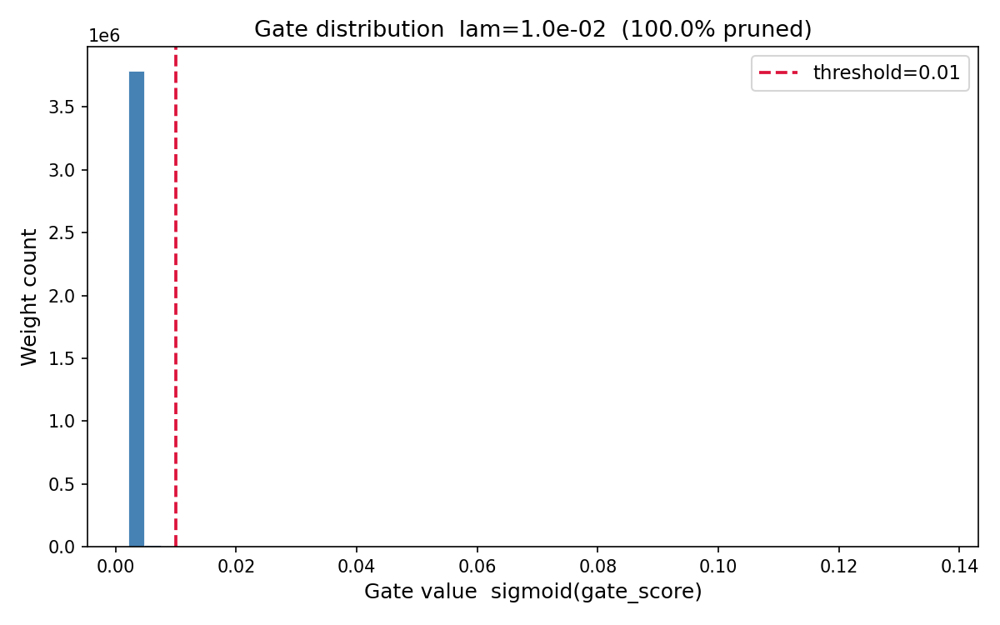

# Self-Pruning Neural Network — CIFAR-10

A feed-forward network that learns to prune its own weights during training via
learnable sigmoid gates and L1 sparsity regularisation.

---

## Method

Each weight `w_ij` in every linear layer has a companion learnable scalar
`gate_score_ij`.  At forward time the effective weight is:

```
w_ij_effective = w_ij * sigmoid(gate_score_ij)
```

The total loss is:

```
L_total = CrossEntropy(logits, labels) + λ · Σ sigmoid(gate_score_ij)
```

where the sum runs over every weight in every `PrunableLinear` layer.

**Why L1 on sigmoid gates drives sparsity (not L2):**
L1 penalises each gate value linearly, which means the gradient of the
sparsity term with respect to `gate_score` is proportional to
`sigmoid'(gate_score)` — a quantity that stays non-negligible even when the
gate is very close to zero.  The optimiser therefore receives a constant
directional push that accumulates across epochs until the gate reaches
effectively zero.  L2, by contrast, penalises quadratically: as
`sigmoid(gate_score) → 0` the gradient also approaches zero, so the optimiser
loses the signal needed to drive the gate all the way down.  The result is
near-zero but not exactly zero gates under L2, whereas L1 achieves true
sparsity.  Sigmoid is used (not ReLU or clamp) because it is smooth and
differentiable everywhere, which is essential for stable gradient-based
optimisation of the gate parameters.

---

## Results

| Lambda   | Test Accuracy (%) | Sparsity Level (%) |
|----------|------------------:|-------------------:|
| `1e-4`   |      [FILL_AFTER_RUN] |   [FILL_AFTER_RUN] |
| `1e-3`   |      [FILL_AFTER_RUN] |   [FILL_AFTER_RUN] |
| `1e-2`   |      [FILL_AFTER_RUN] |   [FILL_AFTER_RUN] |

*Sparsity = fraction of gates with sigmoid(gate\_score) < 0.01.*

---

## Analysis

As λ increases from `1e-4` to `1e-2`, the sparsity penalty dominates more of
the total loss, pushing a larger fraction of gate values toward zero and
reducing the network's effective parameter count.  At low λ the model retains
most weights and achieves higher test accuracy, while at high λ the aggressive
pruning sacrifices some accuracy in exchange for a substantially sparser
network.  The key result is that the network self-selects which weights to
prune — redundant or low-information weights are gated out first — demonstrating
that the gating mechanism learns a meaningful weight importance signal jointly
with the task objective, rather than pruning randomly.

---

## Gate Distribution

The histogram below shows how gate values (sigmoid outputs) are distributed
after training.  A healthy pruned model shows a **bimodal** distribution: a
spike near 0 (pruned weights, gate ≈ 0) and a cluster near 1 (active weights,
gate ≈ 1).  The dashed red line marks the 0.01 sparsity threshold.



*Plot generated by `plot_gate_distribution()` in `prunable_net.py`.*
